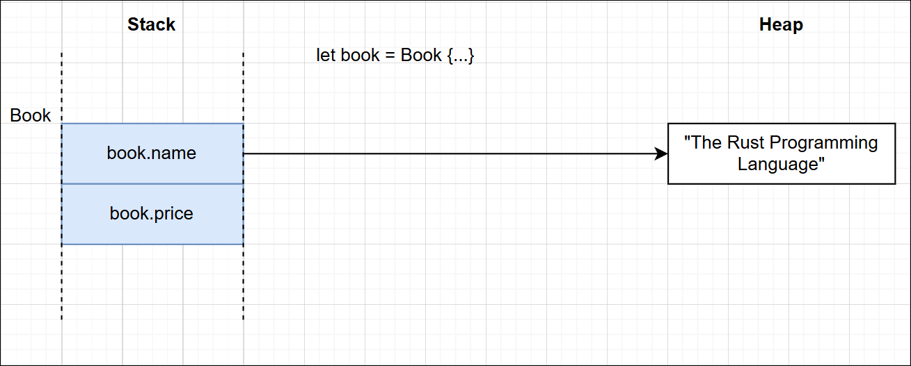
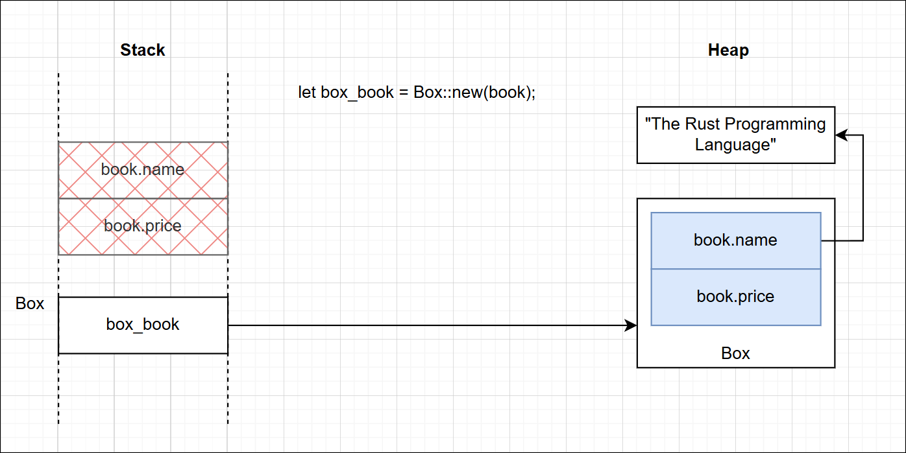
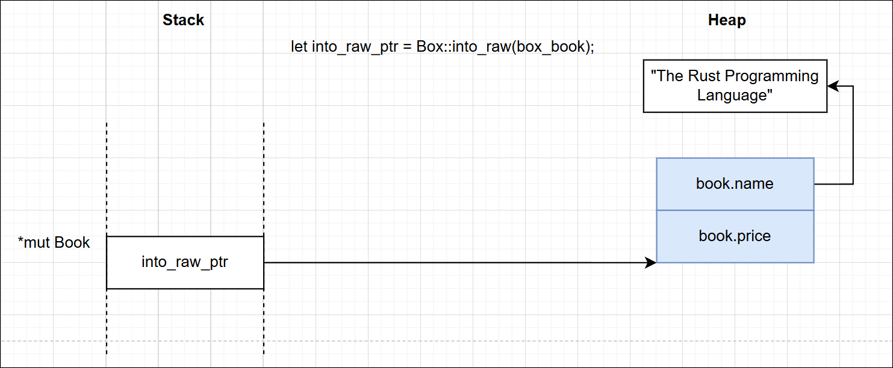
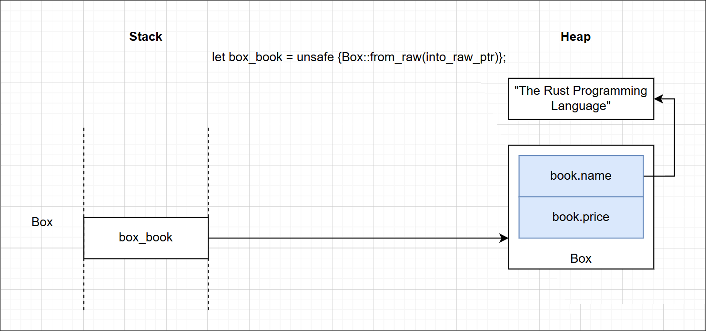
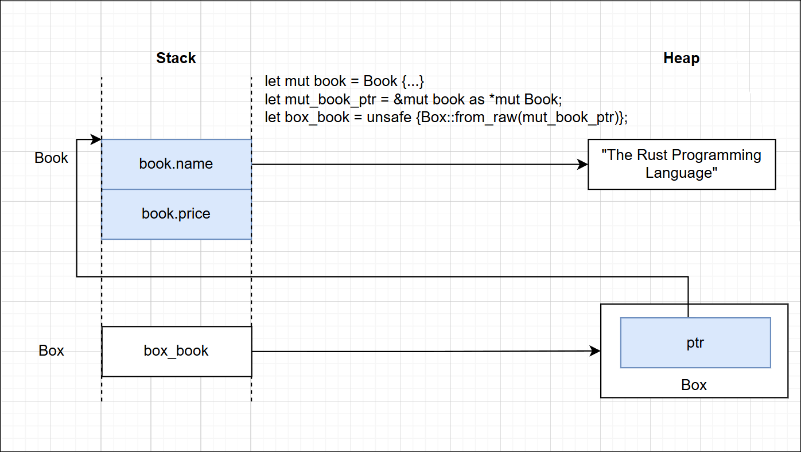

## Rust: A Deep Dive into Box and Manual Heap Ownership

This article explains how objects can be moved from the Stack to the Heap in
Rust. We'll use the simple `Book` struct below as our running example. It also
implements the `Drop` trait so we can clearly observe when each object is
destructed.

```rust
use std::io;
use std::mem;

struct Book {
    name: String,
    price: u32,
}

impl Drop for Book {
    fn drop(&mut self) {
        println!("Dropping Book: {}", self.name);
    }
}
```

When we create an object the usual way, as shown below, it is allocated on the
stack.

```rust
fn main() {
    // Allocated on the stack, will be dropped when it goes out of scope
    let mut book = Book {
        name: "The Rust Programming Language 1".to_string(),
        price: 39,
    };
}
```



To move an object from the Stack to the Heap, we use the `Box` type from the
`std::boxed` module.

```rust
    let box_book = Box::new(book);
```

The statement above moves the object from `book` onto the Heap. After this
point, the object no longer exists on the Stack, and ownership is transferred to
`box_book`.



An important point to remember is that in both cases, whether the object lives on
the Stack or on the Heap inside a `Box`, the destructor of the `Book` object is
called automatically once the owning variable goes out of scope. In the first
case, the lifetime is governed by the `book` variable. In the second case, it is
governed by the `box_book` variable. Since ownership has already been transferred
to the `Box`, the destructor runs only when `box_book` goes out of scope, so we
see just a single line printed:
`Dropping Book: The Rust Programming Language 1`


Now let's explore a couple of useful methods available on the `Box` type.

1. `pub fn into_raw(b: Box<T>) -> *mut T`
2. `pub unsafe fn from_raw(raw: *mut T) -> Box<T>`
3. `pub fn leak<'a>(b: Box<T, A>) -> &'a mut T`

`Box::into_raw()` unwraps the Box and returns a mutable raw pointer to the
underlying object on the heap.

```rust
    let into_raw_ptr = Box::into_raw(box_book); // returns *mut Book
```



An important thing to note here is that `into_raw_ptr` is just a raw pointer to
the object on the Heap. The problem is that a raw pointer cannot call the
object's destructor when it goes out of scope, so the memory would leak.

`Box::from_raw()` wraps the object pointed to by the mutable pointer back into a
`Box`.

```rust
    let box_book = unsafe { Box::from_raw(into_raw_ptr) };
```



Now, once again, when `box_book` goes out of scope it automatically calls the
destructor on the Box, and in turn on the underlying `Book` object.

The reason this function is considered dangerous, and therefore marked unsafe, is
that the caller must ensure the pointer actually points to an object that was
previously allocated by a `Box`; in other words, it must already live on the
heap. To illustrate, let's take the example below, where we deliberately pass a
mutable raw pointer to a stack-allocated object into `from_raw()`.

```rust

    let mut book = Book {
        name: "The Rust Programming Language 2".to_string(),
        price: 39,
    };

    let mut_book_ptr = &mut book as *mut Book;

    let box_book = unsafe { Box::from_raw(mut_book_ptr) };

```



This is how it is laid out in memory. We now have two owners of the same object,
one via `box_book` and the other via the original `book`. When the scope ends,
both variables try to destruct the same object, causing memory corruption or an
access violation. In fact, if we run it on Windows, we get:

```text
Dropping Book: The Rust Programming Language 2   <-- one destructor already called
error: process didn't exit successfully: `target\debug\practice.exe` (exit code: 0xc0000374, STATUS_HEAP_CORRUPTION)
```

Finally, let's look at the `leak()` method. It unwraps a `Box` and returns a
mutable reference to the underlying object, which still lives on the heap. This
gives us exclusive access to an object that now has no owner. It is dangerous as
well, because we have effectively leaked the object forever. The only way to
have its destructor run again is either by converting the raw pointer back into
a `Box` with `Box::from_raw()`, or by calling `std::ptr::drop_in_place()`.

```rust
    let mut_book_ref = Box::leak(Box::new(book));

    // convert back to a Box to cause the drop
    let mut_book_ptr = mut_book_ref as *mut Book;
    let box_book = unsafe { Box::from_raw(mut_book_ptr) };

    // or explicitly drop the memory using `drop_in_place()`.
    let mut_book_ptr = mut_book_ref as *mut Book;
    unsafe { std::ptr::drop_in_place(mut_book_ptr) };
```


Here is the full example:

```rust
#![allow(unused, unused_variables, unused_imports, dead_code)]

use std::io;
use std::mem;

struct Book {
    name: String,
    price: u32,
}

impl Drop for Book {
    fn drop(&mut self) {
        println!("Dropping Book: {}", self.name);
    }
}

fn main() {
    // // Allocated on the stack, will be dropped when it goes out of scope
    // let mut book = Book {
    //     name: "The Rust Programming Language 1".to_string(),
    //     price: 39,
    // };

    // // Moves the book into a Box, meaning there is nothing on the stack now.
    // // When box goes out of scope, the book will be dropped.
    // let box_book = Box::new(book);

    // // Hand over a pointer to the heap memory to the object inside the Box and
    // // the original Box no more the owner of Book. This will not drop the
    // // memory(no destructor will be called).
    // let into_raw_ptr = Box::into_raw(box_book);

    // // Because the pointer is now on the heap, we can safely convert it back
    // // into a Box. Which can be dropped when the box goes out of the current
    // // scope
    // let box_book = unsafe { Box::from_raw(into_raw_ptr) };
    // // ----------------------- DONE -----------------------

    // // allocates the book on the stack, meaning it will be dropped when it goes
    // // out of scope
    // let mut book = Book {
    //     name: "The Rust Programming Language 2".to_string(),
    //     price: 39,
    // };

    // let mut_book_ptr = &mut book as *mut Book;
    // // we are trying to box the book from a raw pointer. this is unsafe if the
    // // that raw pointer is living on the stack because when the function ends,
    // // both the stack and the heap will try to drop the same book, leading to a
    // // double free error.
    // let box_book = unsafe { Box::from_raw(mut_book_ptr) };
    // ----------------------- DONE -----------------------

    let mut book = Book {
        name: "The Rust Programming Language 3".to_string(),
        price: 39,
    };

    // This is similar to from_raw() but here we are given back the not a raw
    // pointer but a reference to the heap memory. Which also means we are not
    // the owner and we cannot drop the memory.
    let mut_book_ref = Box::leak(Box::new(book));

    // convert back to a Box to cause the drop
    let mut_book_ptr = mut_book_ref as *mut Book;
    let box_book = unsafe { Box::from_raw(mut_book_ptr) };

    // explicitly drop the memory using `drop_in_place()`.
    let mut_book_ptr = mut_book_ref as *mut Book;
    unsafe { std::ptr::drop_in_place(mut_book_ptr) };
    // ----------------------- DONE -----------------------
}
```
