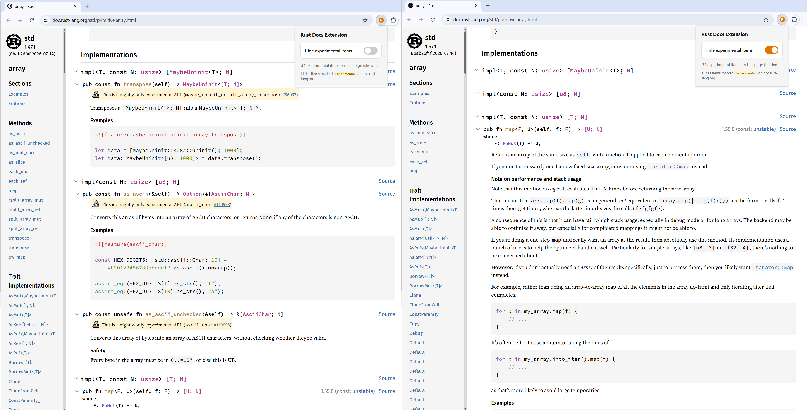

## Rust: Docs

Unlike many other languages, Rust is hard to grasp. Not because it has some new
novel ideas but because it is genuinely a different language compared to the well
known bunch. In my experience trying to master it (I am still learning my way
through it), it feels like there are so many disconnected concepts like
traits/borrow checker/enums/iterators/unsafe etc, which are easy to understand in
isolation but hard to make use of in large scale applications. Not because there
is something wrong with them but because it requires a different mental model if
you are coming from other systems programming languages.

Make no mistake, Rust has some of the best content available to learn from in
articles/books/videos etc after reading the usual text books. I have been
programming in Rust for a couple of years now. But still I don't feel comfortable
using the language to its fullest potential. This could be partly because, like I
said before, I am studying its features in isolation. So in this regard, I want
to lay out the foundation for myself by practicing Rust everyday by actually
writing Rust code. For this to work, I would like to start with the [Rust
standard library documentation](https://doc.rust-lang.org/std/).

One of the problems I encounter when trying to read the documentation is the
sheer number of nightly or experimental APIs that get in your way when you
are just getting started. For my use case, I want to just begin with what works
with the stable compiler; I don't want to be bombarded with nightly APIs.
Generally Rust's documentation is amazing in terms of UI and navigation. But
strangely it does not have an option to hide all these nightly APIs, so that I
can focus only on a much smaller subset of stable APIs.

Luckily I was able to code a Chrome extension that can be used to filter out
these nightly APIs. It is working for my use case and published to the [Chrome
Web
Store](https://chromewebstore.google.com/detail/rust-docs-extension/fimpmclobkeidononogpjpbjdfgookom)
so others can benefit. [rust_docs_extension](https://github.com/vineelkovvuri/rust_docs_extension)

Now that we have a better way to navigate Rust docs, I am thinking of beginning
with the first module and working my way through each and every API on a daily
basis. The goal is not just getting familiar with the API but to really
understand to some extent how it is implemented from the first principles of
the language. I hope this will give me not only the language features but also how
they will be used. Hopefully after a couple of months I will expand this to
reviewing and understanding real world projects.

Feel free to check out the above Chrome extension if you are a Rustacean