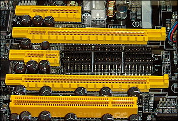

---
title: "PCI Express Basics 101"
date: 2018-12-10T18:33:07-07:00
toc: true
---

# Introduction

PCI Express: It is a standard which comes in multiple generations and multiple
lane configurations. PCI-E is in its 5th generation, but mostly the current
shipping generation is 3rd generation also called as Gen 3. Mainly each
generation improves upon the previous generation regarding the speed per lane
supported by the protocol.

Below is the table for each generation and lane speed
For single-lane and 16-lane links, in each direction:

| Generation | x1         | x16        |
| ---------- | ---------- | ---------- |
| Gen 1      | 250 MB/s   | 4 GB/s     |
| Gen 2      | 500 MB/s   | 8 GB/s     |
| Gen 3      | 985 MB/s   | 15.75 GB/s |
| Gen 4      | 1.969 GB/s | 31.51 GB/s |
| Gen 5      | 3.938 GB/s | 63 GB/s    |

There are PCIE connectors in x1, x2, x4, x8, x16 configurations. The
specification also makes sure in an x16 physical connector we can plugin in any
card with x1, x2, x4, x8, x16. One important fact about physical connectors is,
x16 physical may not be powering all the 16 lanes so for example in a
motherboard if an x16 connector is fueling only x4 lanes, it means, The
connector is limited to x4 speeds.

Different type of physical PCIE connectors

Now to understand each connectors capability we need to refer the motherboard
manual. They explicitly talk about the supported connectors and their
configuration for the CPU maximum supported lane count. After all CPU max
supported PCI-E lane count is what matters and how the motherboard takes
advantage of these lanes.

Gigabyte Motherboard manual description of on board PCIE connectors and their
configurations

# References

- [How PCI Express Works](https://computer.howstuffworks.com/pci-express.htm)

