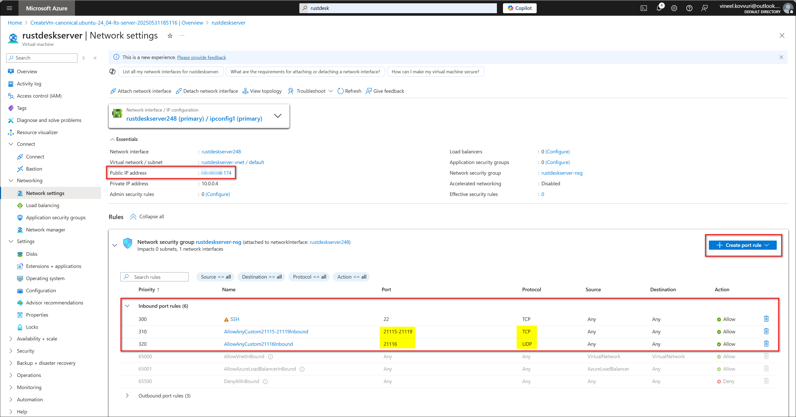
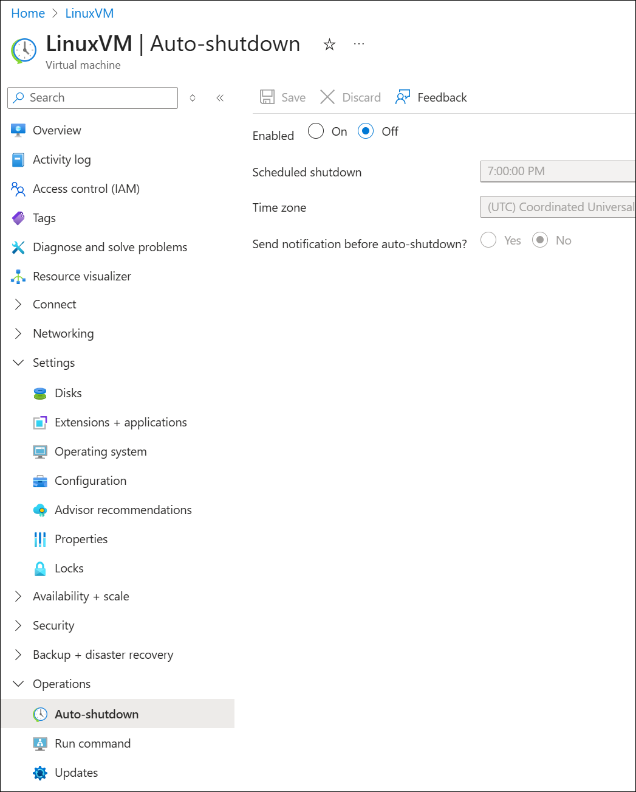
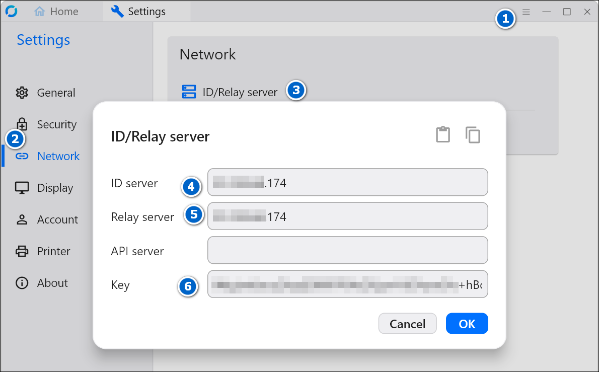
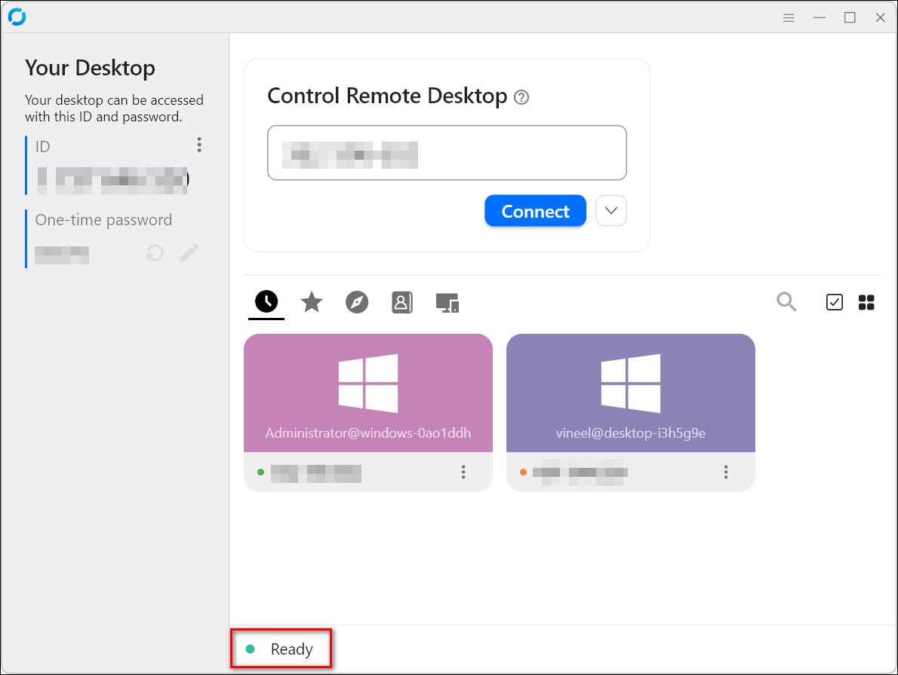

# Self-Hosting RustDesk Server on an Azure Ubuntu VM

I've been a heavy user of TeamViewer and AnyDesk for over 15 years, primarily to
help my family and friends with troubleshooting. Over time, these tools have
become increasingly buggy and locked behind paywalls. I recently started looking
for a free alternative—and that's when I found
[RustDesk](https://github.com/rustdesk/rustdesk).

One of the best things about RustDesk is that it’s open source and completely
free. Like other remote desktop tools, RustDesk relies on intermediate servers
(relay servers) to connect computers over the internet (with the user's
consent). While it comes pre-configured to use public relay servers, RustDesk
strongly recommends setting up your own server for improved performance and
control.

In this tutorial, I’ll walk you through how to self-host a RustDesk server on an
Azure Ubuntu VM.

---

## Setting Up the RustDesk Server on an Azure VM

First, spin up a small Ubuntu VM on Azure. The private key will be downloaded
during the VM creation process, and the public IP address can be found on the
VM's **Overview** page. I used `rustdeskuser` as the username and connected to
the VM via SSH.


```bash
ssh -i rustdeskserver_key.pem rustdeskuser@<VM_IP_ADDRESS>
```

Before installing the RustDesk server, make sure the necessary ports are open in
the VM’s firewall.



Once the ports are open on the Firewall page, run the following commands to
allow access to those ports from inside the VM as well.

```bash
sudo ufw allow 21114:21119/tcp
sudo ufw allow 8000/tcp
sudo ufw allow 22/tcp       # for ssh
sudo ufw allow 21116/udp
sudo ufw enable
```

Make sure to disable VM Auto shutdown feature.


Next, download and run the installation script:

```bash
wget https://raw.githubusercontent.com/techahold/rustdeskinstall/master/install.sh
chmod +x install.sh
./install.sh
```

During the installation:

* Choose **IP address** when prompted between IP or DNS.
* Select **No** when asked whether to install an HTTP server.

After the setup completes, the script will display something like the following:

```bash
Your IP/DNS Address is xxx.xxx.xxx.174
Your public key is xxxxxxxxxxxxxxxxxxxxxxxxxxx+hBoAn8=
```

That’s it! Your RustDesk server is now set up.

---

## Configuring the RustDesk Client

On your client machine, open the RustDesk app and go to the settings section.
Enter the IP address of your new RustDesk server along with the public key.



Once configured, the client will indicate a successful "ready" status:



The same settings need to be configured in your friend's RustDesk client as well.

Happy assisting and troubleshooting your friends!
