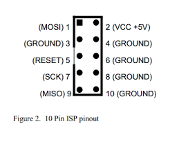
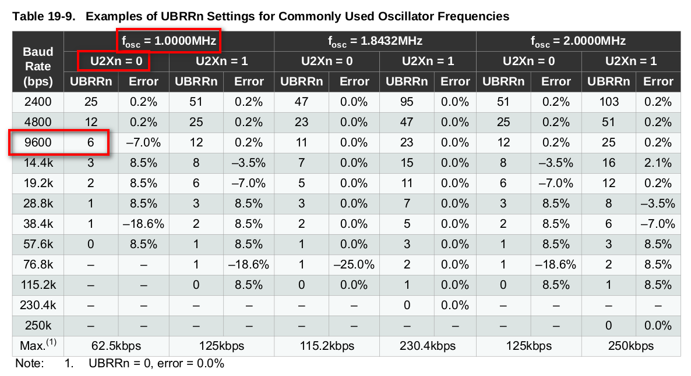
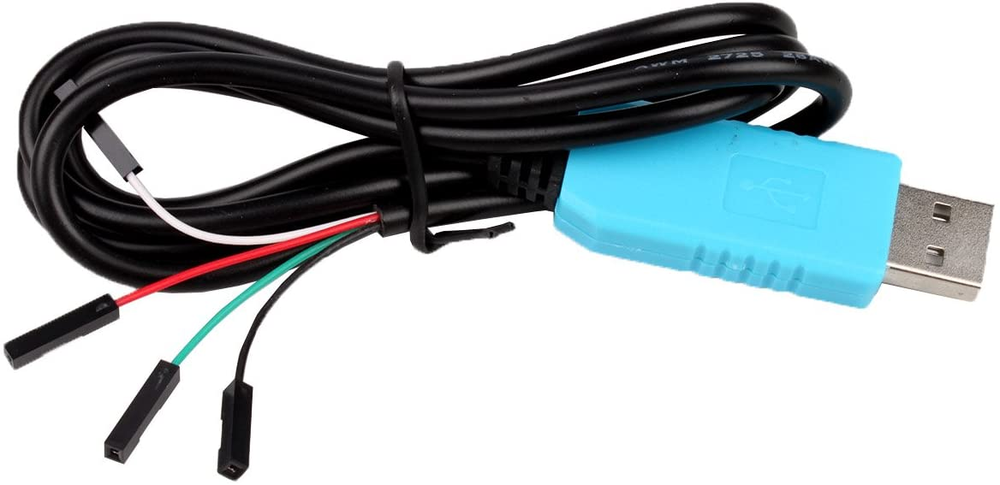

---
title: "UART - From AVR to Linux to Logic Analyzer"
date: 2019-09-20T18:33:07-07:00
toc: true
---

# UART - From AVR to Linux to Logic Analyzer

# Introduction

In this article, let's see how a program running on Atmega328PU microcontroller
can communicate to external world using UART. In order to run through this
exercise we need below equipment.

1. [Atmega328PU Microcontroller](https://www.aliexpress.com/item/32973635527.html?spm=a2g0s.9042311.0.0.27424c4dOZJfJV)
2. Breadboard
3. [AVR/USBASP programmer](https://www.aliexpress.com/item/32651814443.html?spm=a2g0s.9042311.0.0.27424c4dOZJfJV)
4. [USB to TTL Adapater](https://www.amazon.com/gp/product/B00QT7LQ88/ref=ppx_yo_dt_b_asin_title_o02_s00?ie=UTF8&psc=1)
4. [Logic Analyzer](https://www.aliexpress.com/item/33062091072.html?spm=a2g0s.9042311.0.0.27424c4dHus6xH)
5. [Digital Oscilloscope](https://www.aliexpress.com/item/33024255264.html?spm=a2g0s.9042311.0.0.65aa4c4dDiDkXx)

# Atmega328PU pinout

It is an 8-bit microcontroller(uC) with following pinout. All its digital pins
are grouped in to 4 banks(PA/PB/PC/PD).
 

# USBASP programmer pinout
All of the pins highlighted on uC with pink should be connected to below
appropriate usbasp pins




# Complete setup with host
Below is the complete setup and USBASP, USB to TTL adapter, Logic Analyzer
routed through an USB hub connected to the host machine. Hook the USB to TTL
Adapter to TX pin to monitor the string in cutecom. Also, to actually see the
electrical signals transmitted on the TX pin, connect the Logic Analyzer channel
zero pin to TX pin of the uC.

 

# Simple UART program to send information out of Atmega328PU

Below sample program will initialize the UART and transmits "Hello UART" string
on TXD(PD1) pin on the uC.

 


```c
#include <string.h>
#include <avr/io.h>
#include <util/delay.h>
#include <util/setbaud.h>

void USART_Init() {
    // Set baud rate
    // By default, atmega328p runs at 1Mhz without external oscilator
    // So as per the data sheet the UBBR value should be 6 for 9600 baud rate
    UBRR0H = 0;
    UBRR0L = 6;

    UCSR0A &= ~(1 << U2X0);

    // Enable receiver and transmitter
    UCSR0B = (1<<RXEN0)|(1<<TXEN0);
    // Set frame format: 8data, 1stop bit
    UCSR0C = (3<<UCSZ00);
}

void USART_Transmit(unsigned char data) {
    // Wait for empty transmit buffer
    while (!(UCSR0A & (1<<UDRE0)));
    // Put data into buffer, sends the data
    UDR0 = data;
}

int main() {
    char outstr[50] = "Hello UART \r\n";
  
    USART_Init();
    DDRB = 0xff;
    while (1) {
        for (int i = 0; i < strlen(outstr); i++) {
            USART_Transmit(outstr[i]);  // to test
        }
    }
  
    return 0;
}

```

Flash the above program to the uC(check references for the sample makefile) and
connect USB to TTL adapter to TX pin of the uC. Then fire up cutecom(as sudo)
and connect the appropriate ttyUSB and make sure the baudrate is set to 9600.

 
 

This confirms both the transmission of data from uC and reception on the host
machine. But in order to actually look at the electrical signals we can use a
cheap logic analyzer. This logic analyzer works with [Saleae Logic Analyzer
software](https://www.saleae.com/downloads/).

Below is the waveforms captured and appropriately decoded in the logic analyzer
 software
 

Finally, If you are curious, you can also watch the same in a cheap oscilloscope
 like below! 
# References

- [Saleae Logic Analyzer](https://www.saleae.com/downloads/)
- [ATMega328P Datasheet](https://www.sparkfun.com/datasheets/Components/SMD/ATMega328.pdf)
- [UART Code sample](https://github.com/vineelkovvuri/AVR-Programming/tree/master/mycode/serialIO)
