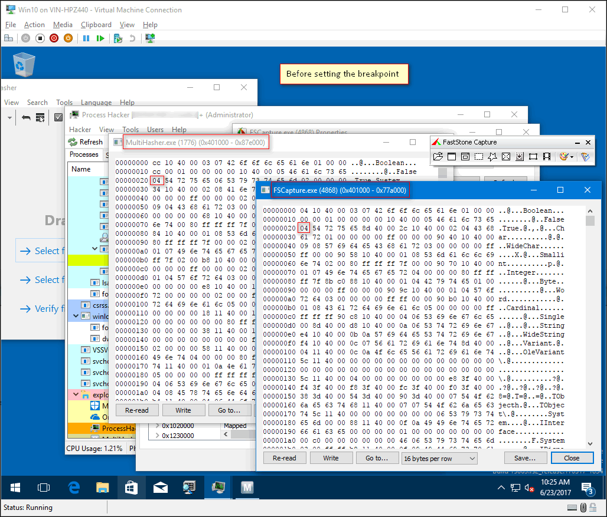
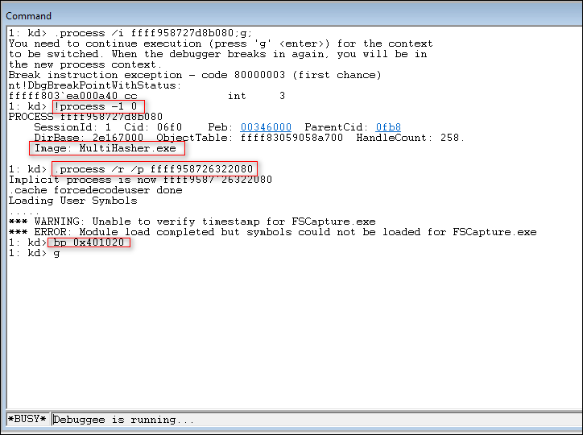
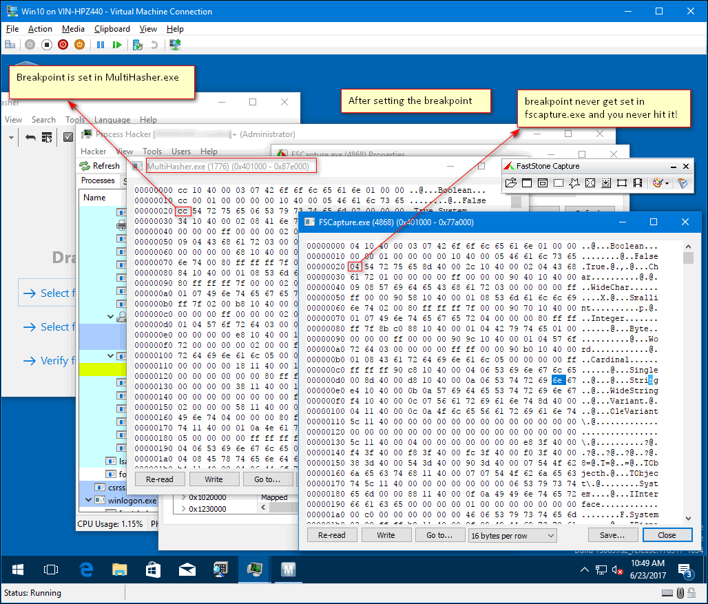
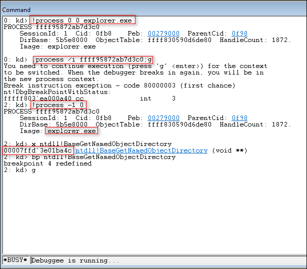
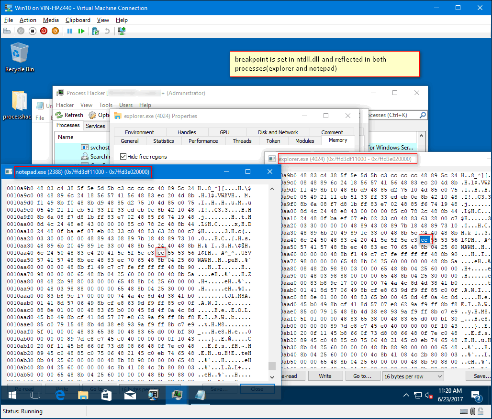

# Introduction

When performing KD(Kernel Debugging) in Windows with Windbg if you have to set a
break point in a user mode process we should always use **.process /i address;
g; .reload /user**. Lot of good content is written on the
[internet](https://www.osronline.com/article.cfm%5Earticle=576.htm) on this
command, but nothing seemed to explain why this command should be used instead
of the familiar **.process /r /p address**. I would like to shed some light on
this. Before reading any further I would strongly encourage you to read about it
from above link. In this article I assume some basic knowledge on how kernel
debugging is done with Windbg. Also, I would like to start with the following
question.

> If the debugger has read/write access to the user mode process via .process /r
/p why cannot it insert int 3 in user mode process when performing KD? Why do we
have to make the user mode process the current process context by running
.process /i ?

To explain this we need to quickly understand how break points work.

# How do break points work in user mode debugging

Below are the steps involved for a break point to work in debugging a user mode process.

- bp address - you are just instructing the debugger to make a note of
  "address" and replace the byte at that address with 0xcc (int 3) when
  target resumes to execute
- g - when you hit "g" the debugger replaces the byte with 0xcc and stores
  the original byte with it
- After execution when processor execute the modified byte (0xcc) this
  causes the debugger to break in and debugger puts back the original byte
  as if nothing has happened to the program
- More details:
  http://vineelkovvuri.com/posts/how-do-breakpoints-work-in-debuggers/

# User mode break points from KD

When debugging a user mode process from KD the steps works exactly same as above
but with a slight twist.

- Let's assume during KD, when the debugger broke, the processor is
  executing a process named mulithasher.exe(see note below)
- When you switch the windbg's view to a different process(fscapture.exe) by
  .process /r /p fscaptureaddress, you are not changing the underlying
  execution of the processor. !process -1 0 still shows multihasher.exe
- With /r /p you now have read/write access to the fscapture process. This
  confirms the first part of the question
- bp address - same as above, you are instructing the debugger to make a
  note of "address" and replace the byte at that address with 0xcc (int 3)
  when target resumes to execute
- when you hit "g" the debugger replaces the byte at address with 0xcc in
  the currently executing process which happens to be multihasher.exe not
  fscapture.exe!

Before break point getting updated

Setting the break point

After break point is updated

- This means, "g" command used to resume the target is the culprit(may be it
  is by design). This answers the second part of the question
- So by using .process /i address;g; windbg will break under your process
  context(how?). After which setting a break point and hitting "g" will
  cause the debugger to actually put int 3 in your process not somewhere
  else

NOTE: I initially made multihasher.exe the process context by using .process /i
      multihasher address;g;

# Setting breakpoints in system dlls

This .process /i is not required if you are putting breakpoints in system dlls
like kernelbase, ntdll etc because these dlls are loaded at the same virtual
address in all the user mode processes and they have a single copy in the
physical memory. So once a break point set in a process the break point is
visible in all other processes which uses that system dll. Below we illustrate
this by setting a break point in ntdll.dll. (Even here just make sure when you
broke initially you are not in System process as it will not have ntdll!)

Break point is set only in ntdll of explorer process

Break point set in ntdll of explorer gets reflected in ntdll of notepad also

# References

- [Analyst's Perspective: Analyzing User Mode State from a Kernel Connection](https://www.osronline.com/article.cfm%5Earticle=576.htm)
- [How Windows Debuggers Work?](https://www.microsoftpressstore.com/articles/article.aspx?p=2201303&seqNum=2)

