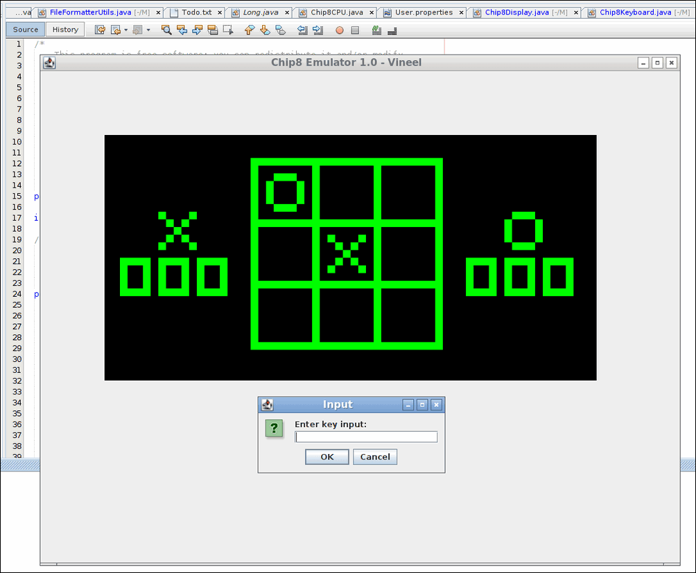
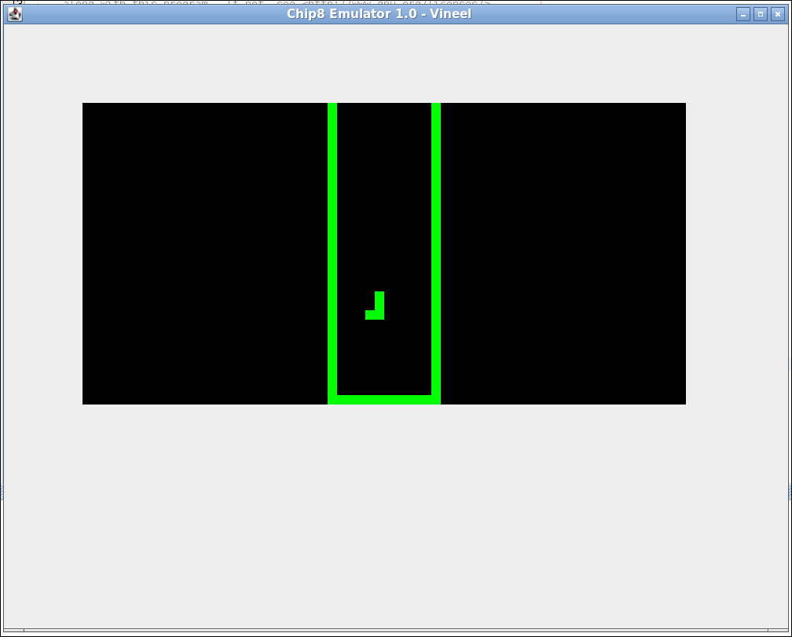
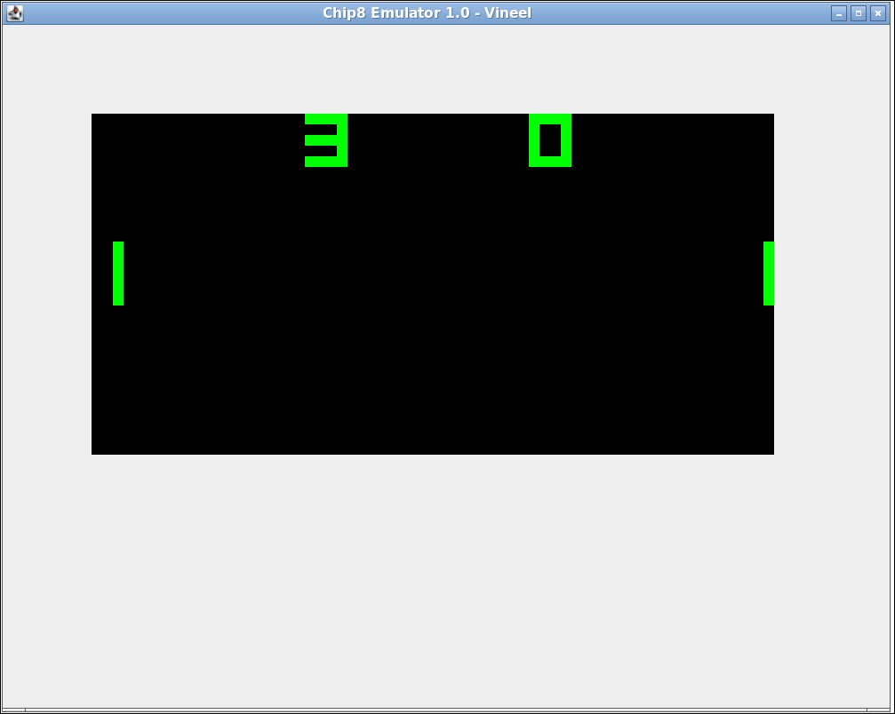
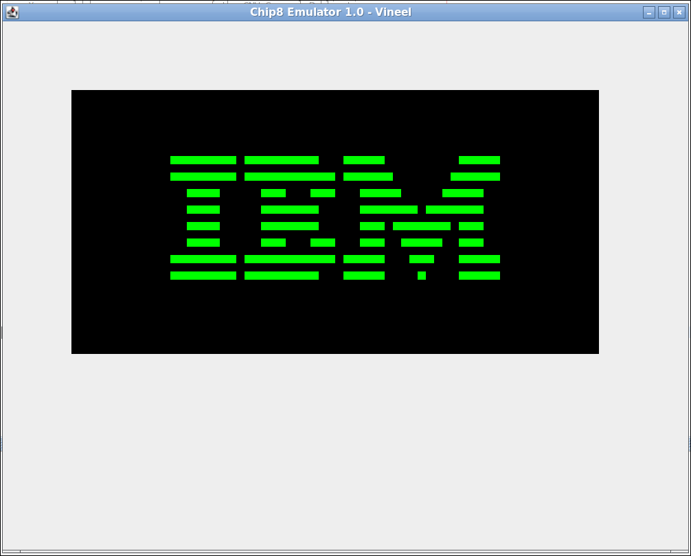

---
title: "What Does It Take To Write An Emulator In Java?"
date: 2019-04-10T18:33:07-07:00
toc: true
---

# Introduction

I am proud, This weekend I did some productive work. I was able to code Chip
8 emulator in Java over a night. I have always been fascinated by them and
finally I was able to get the damn thing to work! For those of you who are
not familiar with software emulator, It is a software which can emulate the
functionality of other hardware or software components. Notable examples are
video game emulators([Dosbox](https://en.wikipedia.org/wiki/DOSBox) ,[NES Emulator](https://en.wikipedia.org/wiki/List_of_video_game_emulators)),
general purpose software emulators([QEmu](https://en.wikipedia.org/wiki/QEMU))

# What is Chip 8?

It was the software used in some of earlier 8 bit microprocessors. Which
provided portability across multiple computer models. Think of it as the JVM
of 1970. Similar to JVM byte codes, it has an instruction set. Any program
written in this instruction set can be interpreted by the Chip 8
interpreter(which will be preloaded in to memory @ 0x0). Over the weekend, I
was trying to write an emulator for this instruction set. Fortunately, I
tried and succeeded in do it. In this article I would like to share my
thoughts about how to write an emulator in its most basic form. More info of
chip 8 can be found [here](https://en.wikipedia.org/wiki/CHIP-8).

# How does a CPU work?

Lets quickly go back to computer organization 101 class. In its most basic
form, Every CPU need two inputs.

1. Data
2. Instructions

To store and retrieve these, CPU also needs a storage location, we call this
as RAM.  Along with this we may also need couple more input/output devices.
The simplest of these are keyboard and display.

Now lets see how all of these interact with one another.  Every CPU when
powered on will have to read its first instruction to execute. The location
of this very first instruction in RAM is usually hard coded to a predefined
location by convention. This is when CPU starts interacting with RAM for the
first time. Once it fetches the instruction from RAM. It tries to decode it,
meaning, it tries to understand want it should do with it. After that, it
will execute the operation. As part of this execution any new results will
be saved backed to RAM. This process repeats forever. This is the classic
Fetch-Decode-Execute cycle. In the process CPU may also interact with
keyboard and display. Below illustration explains the process.


# Emulation

In general, for any processor to emulate other hardware or software
components it has to essentially emulate all the above modules and any
associated peripherals. First, we need to get familiar with the Chip 8
Technical Reference found
[here](http://devernay.free.fr/hacks/chip8/C8TECH10.HTM). This reference covers
pretty much every thing we need. Enough theory, Now lets get to the meat of
the show, THE CODE.

Technically, an emulator can be written in any language. I have chosen Java
for its included batteries/libraries. I have organized the source code of my
implementation into below 5 Objects.

1. CPU(Chip8Cpu.java) - This is the core module which implements the instruction
   set of Chip 8 and its decode logic
2. Memory(Chip8Memory.java) - This emulates the RAM and associated constraint to
   interact with Chip 8 CPU
3. Display(Chip8Display.java) - This emulates the Dxyn - DRW Vx, Vy, nibble
4. instruction to capture the output on to the display
5. Keyboard(Chip8Keyboard.java) - This emulates the keyboard input
6. Main(Main.java) - The main driver program which sets up the system

# CPU

The bulk of the decode processing logic is implemented in the run() method
and each instruction is first fetched using Memory object's getWord()
method(every opcode in of Chip 8 is of 2 bytes). Then decode the instruction
and appropriately run the respective executable code. For the majority of
time, execution mainly results in moving data around.
```java
// Below is the trimmed version of original source code found at
// https://github.com/vineelkovvuri/Projects/tree/master/Chip8Emulator/src/main/java/com/vineelkumarreddy/chip8/Chip8CPU.java
public class Chip8CPU {
    private int V[] = new int[16]; // 8bit each
    private int I;  // 16bit
    private int DT; // 8bit
    private int ST; // 8bit
    private int PC; // 16bit program counter
    private int SP; // 8bit stack pointer
    private int stack[] = new int[16]; // 16bit each

    private final Chip8Display display;
    private final Chip8Keyboard keyboard;
    private final Chip8Memory ram;

    private final int DT_FREQUENCY = 60; // 60 hz
    private final int ST_FREQUENCY = 60; // 60 hz
    private final int HZ = 1000; // 60hz => 60 times in 1sec or in 1000 milliseconds
    public void run() {
        while (true) {
            // FETCH
            int instruction = ram.getWord(PC);
            incrementPC(); // fetched the instruction so move on
            // DECODE
            int opcode = (instruction >> 12) & 0xf;
            switch (opcode) {
                case 0:
                    decode0(instruction);
                    printInstructionDecodeCycle(0);
                    break;
            // Trimmed for brevity
            }
        }
    }
    private void incrementPC() {...}
    private void decode0(int instruction) {
        int opcodeArgs = instruction & 0xfff;
        switch (opcodeArgs & 0xff) {
            case 0xEE: // 00EE - RET
                // EXECUTE
                PC = stack[--SP];
                break;
        }
    }
}
```
# Memory
```java
// Below Is The Trimmed Version Of Original Source Code Found At
// https://github.com/vineelkovvuri/Projects/tree/master/Chip8Emulator/src/main/java/com/vineelkumarreddy/chip8/Chip8Memory.java
public class Chip8Memory {
    // Chip 8 can address up to 4K bytes
    private int ram[] = new int[0x1000];
    private final int DEFAULT_LOAD_ADDRESS = 0x200;
    // Read from RAM
    public int getWord(int index) {...}
    public int getByte(int index) {...}
    // Write to RAM
    public void setByte(int index, int value) {...}
    // Load program
    public void loadProgram(Path path) {...}
    // Dump RAM for debug
    public void dumpRAM() {...}
}
```
The primary operations done by CPU with memory is reads and writes. These
are implemented as getByte() and setByte() operations inside Memory object.
These reads and writes are actually backed up by 4k integer array. This is
the maximum memory addressable by Chip 8 instruction set.

# Display
```java
// Below Is The Trimmed Version Of Original Source Code Found At
// https://github.com/vineelkovvuri/Projects/tree/master/Chip8Emulator/src/main/java/com/vineelkumarreddy/chip8/Chip8Display.java
public class Chip8Display extends JFrame {
    // Chip8 display size
    private final int displayWidth = 64, displayHeight = 32;
    private JPanel display[][] = new JPanel[displayHeight][displayWidth];
    public boolean setPixel(int x, int y) {...}
    public void clear() {...}
}
```
The one and only instruction in the Chip 8 instruction set that interact
with display is Dxyn - DRW Vx, Vy, nibble. When CPU has decoded this
instruction, it interface with the Display object and calls setPixel()
method to turn on/off a pixel. Display is interesting and it deserves some
explanation. The way the instruction works is, given a starting pixel (Vx,
Vy). CPU first reads nibble number of bytes from the memory location pointer
by I register. Now each bit in each byte corresponds to one pixel starting
from (Vx, Vy). For example if jth bit of ith byte is 1 then the pixel at
display[Vx + j][Vy + i] XOR with its previous value. This mechanism is also
called  Stripping in the reference. The Display object simulates each pixel
as a 12×12 size JPanel. The entire display contains 64×32 such pixels or
JPanels. These JPanels are initially added to JFrame window and these will
be set to black for 'off' state and green for 'on' state by setPixel()
method.

# Keyboard
```java
// Below Is The Trimmed Version Of Original Source Code Found At
// https://github.com/vineelkovvuri/Projects/tree/master/Chip8Emulator/src/main/java/com/vineelkumarreddy/chip8/Chip8Keyboard.java
// This listener is added to Chip8Display module to capture the events
public class Chip8Keyboard implements KeyListener {
    // This keeps the state of the chip 8 keyboard's 15 keys
    private boolean keysPressed[] = new boolean[0x10];
    public boolean isChip8keyPressed(int key) {...}
    public void keyPressed(KeyEvent e) {...}
    public void keyReleased(KeyEvent e) {...}
}
```
There are few instructions which interfaces with keyboard. This object is
hooked as the keyboard listener on to the JFrame of Display. This is the
only way that I know in Java to capture the keyboard events. Chip 8 has 15
keys starting with 0-9 and A-F. We maintain the state of these keys using an
array of 16 integers and convert the A-F key events to their corresponding
10-15 indexes in to the above array.

# Main
```java
public class Main {
    public static void main(String... args) {
        // Init peripherals
        Chip8Keyboard keyboard = new Chip8Keyboard();
        Chip8Display display = new Chip8Display(keyboard);
        Chip8Memory ram = new Chip8Memory();
        // Init CPU
        Chip8CPU cpu = new Chip8CPU(ram, display, keyboard);
        // Load program to RAM
        ram.loadProgram(Paths.get("/home/vineel/Downloads/chip8/CHIP8/GAMES/INVADERS"));
        // Run CPU
        cpu.run();
    }
}
```
Finally, this object is responsible for setting up all the modules and
invoking the CPU run() method. Purposefully I kept this object very simple,
especially by hard coding the file path to load.

# Output

Now in order to test this, we need some chip 8 programs/games, also called
as ROM files. A simple google search will return good number of ROM files.
Let's see the output of loading few of them.

Invaders

TicTac

Tetris

PingPong

This one is for my wife, It is really not a game, but this ROM file exist
beside other game files. I know we cannot play with them. IBM ROM for my
wife ;)

I recommend you to read the source code https://github.com/vineelkovvuri/Projects/tree/master/Chip8Emulator.

