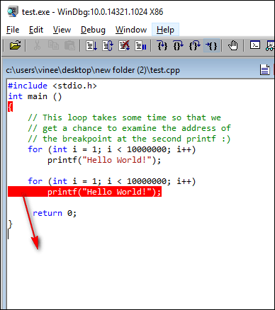
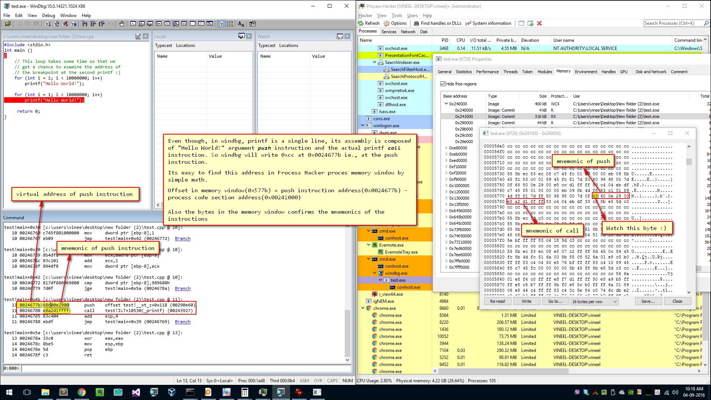
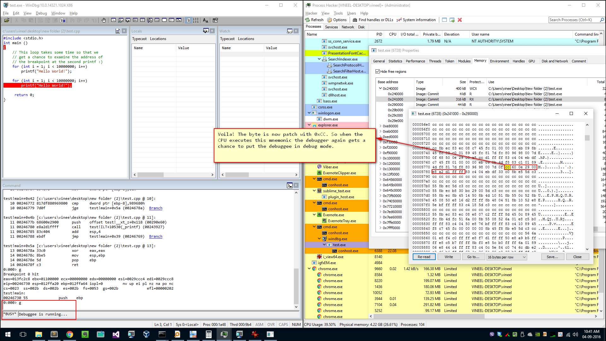
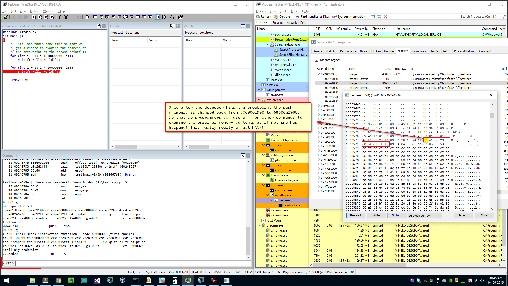

---
title: "How Do Breakpoints Work In Debuggers?"
date: 2018-10-10T18:33:07-07:00
draft: false
toc: true
---

# Introduction

It's been a while, I have got a chance to blog about low-level stuff. In this
article, I am going to explain how breakpoints work in debuggers. I am assuming
the reader is already familiar with what a breakpoint is? and how to set it in
your debugger of choice. The goal of this post is to explain the interplay
between Debugger, Debuggee, Operating System and the CPU.

# Breakpoints Theory

To get there, we have to ask ourselves  What does it mean by debugging a
program/process?. To keep it simple, It's the controlled execution of a program
by other program. The devil is in the word controlled. Whenever you open a
debugger and launch a program or attach to a running process, the OS and the CPU
guarantees that any event (like dll loading or interrupts or exceptions etc)
happening on behalf of debuggee process are notified to debugger process for it
to take necessary action. The important thing to understand here is, it's the
execution of debuggee which is causing the debugger to take actions on behalf of
it, not the other way around.  So there should be something in the debuggee's
code that should cause CPU to do the heavy lifting.  This is where CPU's
breakpoint instruction comes in. Every x86/amd64 CPU provides a special
instruction called breakpoint instruction Int 3 whose mnemonic is 0xCC. When a
piece of code executes this instruction, the CPU triggers a breakpoint interrupt
and notifies it to OS and asks it what needs to be done next. Now this event
from OS gets propagated to debugger by pausing all the threads in the debuggee.
Now it's up to debugger to handle it according to its will.

So far so good, But one question that should bother you at this point is The
programmer never inserted 0xCC instruction in his program when he is writing the
code. Then who puts it in? It's the debugger that puts this 0xCC instruction in
the debuggee processing using WriteProcessMemory Win32 Api in Windows. Let's see
more closely how it is done. Generally, at any given point in time, a debuggee
will be in running or debugging mode. In running mode, debugger has no control
of the debuggee until debuggee hits the above said breakpoint instruction. In
debug mode, it has full control of the debuggee execution, ie.., it can single
step each line of the code, examine call stack/registers etc. This is exactly
the mode in which you can also set additional breakpoints by hitting F9 or 'bp'
or equivalent. So when you ask the debugger to put a breakpoint on the current
line/instruction, the debugger makes  a note of the location/address of the
instruction and it simply gives us below visual feedback but no change is made
to debuggee




After this, when you jump from debug mode to running mode by hitting the go
command either via F5 in Visual Studio or 'g' command in Windbg/gdb, the
debugger patches the first byte of all addresses at which we asked the
debugger to set the breakpoints with 0xCC and let the debuggee run. This is
in a way, the preparation done by debugger to make sure it gets notified
back when CPU control reaches the user set breakpoint. Neat hack! In a
similar way, once the breakpoint is hit, just before putting the debuggee in
debug mode, It will update all the addresses back with their original
content/byte. That is the reason why we don't see this 0xCC instruction when
in debug mode, also this is exactly what we expect because we don't want our
instructions garbled by the debugger with random 0xCC instructions when we
want to examine. Now fasten your seat belts and let's see all of this in
action!

# Breakpoints Practice

Let's consider the above program and see what happens when we set the
breakpoint on the main and second printf lines in WinDbg. Once we set the
breakpoints WinDbg only makes a note of these line addresses. Now when we
hit 'g' WinDbg moves the debuggee to running mode. Let's verify this whether
debugger has patched the printf line with 0xcc before moving to running
mode. Unfortunately, we cannot dump the main function because the program is
already in run mode! i.e., we cannot use commands like 'uf .'  to see
whether the bytes are patched by Windbg. But fortunately, Process Hacker can
help us in peering in the binary at the printf address when the program is
running.  The below screenshot shows the contents of main function at printf
line before hitting go command. So as expected no change at the push
mnemonic before call instruction (just windbg kept a note of the
breakpoints).
```C
#include <stdio.h>
int main ()
{
    // This loop takes some time so that we
    // get a chance to examine the address of
    // the breakpoint at the second printf :)
    for (int i = 1; i < 100000000; i++)
        printf("Hello World!");

    for (int i = 1; i < 10000000; i++)
        printf("Hello World!");

     return 0;
}
```




After the initial for loop is done executing  and just before hitting the second
printf the CPU executes the patched 0xCC instead of original 68600e2900 so this
causes the breakpoint interrupt from CPU to OS and OS notifies this to debugger
to put the debuggee in debug mode. Now debugger does the opposite of restoring
the mnemonics from CC600e2900 to 68600e2900 so that the programmer can examine
the content of the function as if nothing has happened before! Pretty neat HACK!



I am stopping here and let this content sink in your brain. There's more to it,
for example, when the program is running and we want to forcefully break in by
hitting toolbar break button or ctrl+break etc then debuggers in Windows uses
[CreateRemoteThread](https://msdn.microsoft.com/en-us/library/windows/desktop/ms682437(v=vs.85).aspx) Win32 API to create a new remote thread in the debuggee and calls the
ntdll!DbgBreakPoint.

