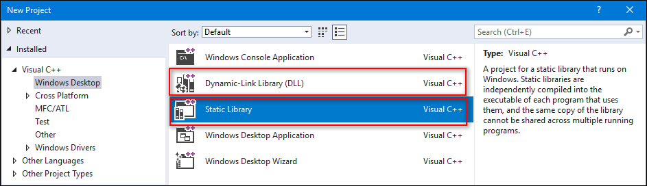
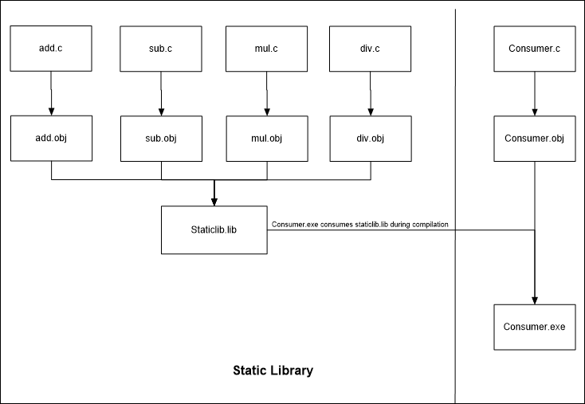
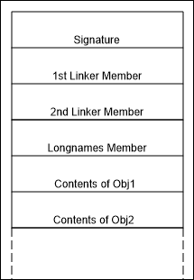
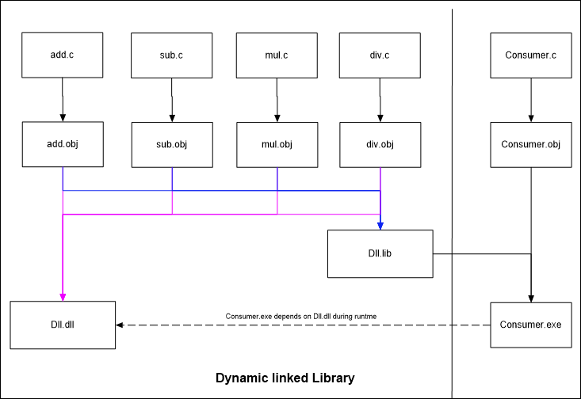
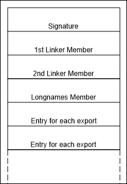

---
title: "Lib Files 101"
date: 2018-11-10T18:33:07-07:00
draft: false
toc: true
---

# Introduction

During the compilation one of the crucial step after assembling is
creating the Object files. The collection of these object files is
called a lib file. We can create these .lib files through following
visual studio project types
1. Static Library
2. Dynamic Linked Library

The format of these .lib files is specified in 'Archive (Library) File Format.'
section of [PE
Format](https://docs.microsoft.com/en-us/windows/desktop/debug/pe-format#archive-library-file-formatspecification).
As per the spec, .lib is an archive of individual .obj files with some metadata.
Multiple tools can be used to extract lib files. Visual Studio installation
contains Lib.exe tool. Since .lib and .obj files follow Unix COFF format Unix
binutil's 'ar' tool can be used to extract it.

Lib StaticLib1.lib /list
Lib StaticLib1.lib /EXTRACT:Debug\sub.obj /out:sub.obj <-- Extracts one file at a time!
or
ar -x StaticLib1.lib
or
use 7-Zip to extract it


Visual Studio New Project dialog for 'Static Library' and 'Dynamic Linked Library'

# Static Library

Static Library is created when you want to provide the complete code to
link into another dll or exe. For example, If a static library
project contains 4 files add.c,sub.c,mul.c,div.c containing functions
for their operations like below respectively.
```C
int add(int a)
{
    return a + 1;
}
```
When you build the project what we get is a .lib file containing obj files
of each of the above .c file. So a static library contains all
the code that gets compiled from your project, and this .lib will
be consumed by any other project types(dll or exe).

NOTE: The functions inside a Static Library is not declared with
__declspec(dllexport) because all functions declared in a static
library are meant to be consumed/included by others directly.

dumpbin /exports StaticLib.lib  <-- shows nothing because .lib itself does not
export anything
dumpbin /symbols StaticLib.lib  <-- shows all the symbols present


Workflow for Static Library creation and consumption


Concluded based on HxD view of the file

# Dynamic Linked Library

Dynamic Linked Library(DLL) is in many ways similar to Static Library because
it also provides the code to be used by other projects like dll or exe,
but the difference is in the way the code gets re-used by consumers.
In DLL, the outcome of the project is not only a .lib file but also a
.dll file. In fact, in case of DLL project, the .lib file does not contain
any .obj file instead it contains only pointers of exported functions to
the dll containing the actual code. In a Dll, all of the code is indeed
present inside the .dll file.

Since .lib does not contain any real .obj unlike static lib, we can
only see the exported symbols but not their code in case of dll's .lib file.
```C
__declspec(dllexport) int add(int a)
{
    return a + 1;
}
```
dumpbin /exports Dll1.lib <-- shows all the exported functions


Workflow for Dynamic Linked Library creation and consumption


Concluded based on HxD view of the file

NOTE: The functions inside a Dynamic Linked Library need to be declared
with __declspec(dllexport) if they have to be visible and consumed
by others(indirectly).

# Static Library with __declspec(dllexport)

This is interesting. When a function inside a static library is declared
with __declspec(dllexport), like any other function, it gets included
by the consumer in his binary(dll) but because it is declared as
__declspec(dllexport) that function gets exported as well from the consumer
binary! Below is a screenshot of Consumer.exe which is exporting sub2 function
because sub2 is actually declared with __declspec(dllexport) in the
original static library.

.png)
sub2 function got exported from the final consumer binary

The takeaway here is Static Libraries are just a convenient archive format
to hold multiple .obj files nothing more or nothing less! So we should be
cautious of how the functions are declared.

# References

- [PE Format](https://docs.microsoft.com/en-us/windows/desktop/debug/pe-format)
