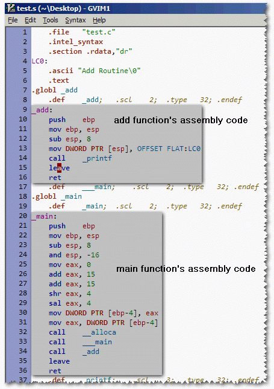
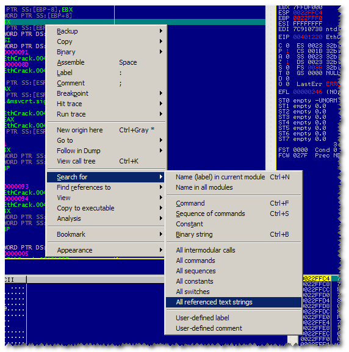
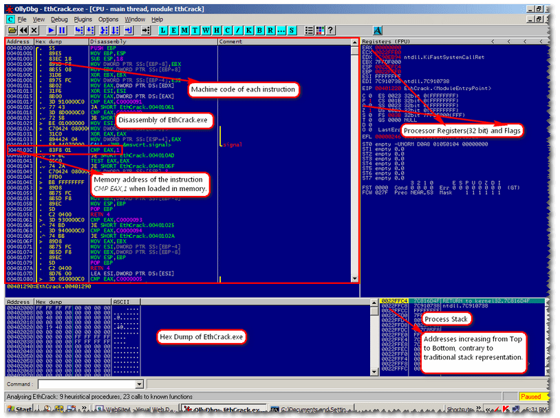
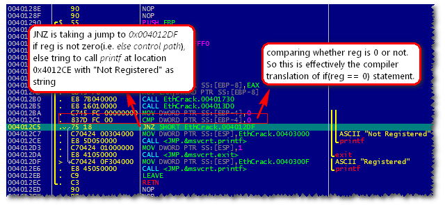
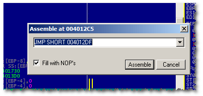
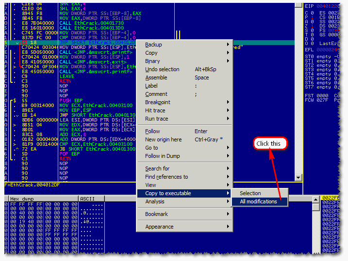
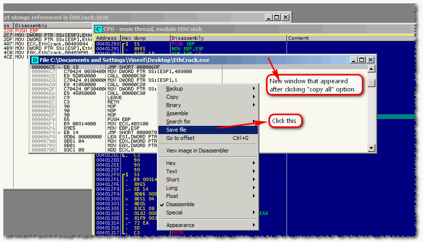
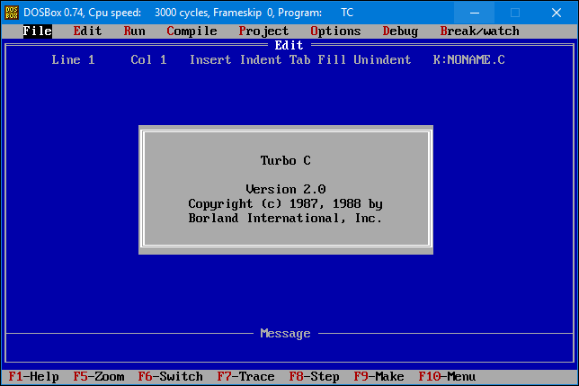

---
title: "A Newbie's Introduction To Compilation Process And Reverse Engineering"
date: 2018-08-10T18:33:07-07:00
draft: false
toc: true
---

# Introduction

Compilers are surely the complex programs of all times. Even today, writing a
compiler with minimum set of tools is considered to be challenging. This
tutorial scratches the surface of different compiler phases involved in
translating a given source code to executable and also shows how this
information is useful in context of reverse engineering.

[GNU compiler collection](https://en.wikipedia.org/wiki/GNU_Compiler_Collection)
provides an excellent set of tools for dissecting the compilation process and to
understand the working of bits and bytes in the final executable. For this
tutorial I am using the following tools and considers C language to illustrate
the examples.

- [Dev-Cpp](http://orwelldevcpp.blogspot.com/) is a IDE with GNU C compiler collection(Mingw) as backend
- [OllyDbg](http://www.ollydbg.de/) An excellent debugger/reverse engineering tool

for Linux environment are also available for Windows(thanks to Many people don't
know that the powerful programmer tools that are available Cygwin/Mingw).
Dev-Cpp is an IDE which consists of entire GNU compiler collection(GCC). This
IDE uses gcc.exe, g++.exe for compiling C, C++ programs and gdb.exe for
debugging. Also, The Dev-Cpp's installation(c:\dev-cpp\bin) directory consists
of all the GNU compiler tools. To start this tutorial set the PATH variable to
Dev-Cpp's bin directory as we will be working completely from the command prompt
and not going to use the IDE.

For debugging, using command line GNU Debugger (gdb.exe) may seem daunting.
To compensate this, we have an excellent user mode debugger for Windows
called OllyDbg. This helps in debugging a running process or a normal exe or
dll file.

# Preprocessing

Preprocessing is the first phase of C/C++ Compilation. It is the act of
processing(textual substitutions) the input sources before being handed over
for parsing(i.e., before splitting in to tokens). The existence of
preprocessing phase in the first place is very specific to C/C++ languages
for historic reasons. Let's consider the following code to understand what
this phase will do

```C
#define PI  3.14156
main()
{
    float f1;
    f = PI*2;
}
```
Assuming this code is saved as test.c, issue the following command(remember
compiler options are case-sensitive) **{gcc -E test.c}**. '-E' switch stops the
compilation process after preprocessing. Now gcc.exe will produce the
following output.
```C
# 1 "test.c"
# 1 "<built-in>"
# 1 "<command-line>"
# 1 "test.c"

main()
{
    float f1;
    f = 3.14156*2; // Preprocessor macro substituted
}
```

The preprocessing phase of the compiler replaced all preprocessor directives
like PI e.t.c in the output. To keep the output simple I have not included
any header files. By observing the output we can conclude few points.

- Preprocessor will not compute the expression values. For example in
  the above output the preprocessor just replaced PI with its macro
  definition and the expression 3.14156*2 is left as it is
- Preprocessor don't check for syntax errors because the above output
  contains no compiler errors even though we used a variable f without
  declaring it

With this information, what will be the value printed by printf in the
following example?
```C
#define Add(x,y) x+y
#define Sub(x,y) x-y
#define AddMulSub(x,y) Add(x,y)*Sub(x,y)
main()
{
    printf("%d",AddMulSub(10,2));
}
```
Many of us will try to solve the above snippet as Add(10,2)*Sub(10,2) => 12*8
=> 72 (because Add(10,2) = 10 + 2 = 12 and Sub(10,2) = 10 - 2 = 8) but this is
incorrect because from previous observation we know that preprocessor will not
evaluate expressions. So, AddMulSub(10,2) is expanded as Add(10,2)*Sub(10,2) and
this again replaced with Add,Sub macros as *10 + 2 * 10 - 2 = 10 + (2 * 10) - 2
= 28*

# Compilation

Compilation phase translates the output file from preprocessor in to
architecture specific assembly code. It is one of the core phases of a
compiler. It comprises of following 4 stages

# Lexical Analysis

The responsibility of a lexical analyzer(or Lexer for short) is to split the
given program in to valid language tokens(or lexems).  For example consider
the following code.
```C
main()
{
    c = a << b;
}
```
Now the Lexer recognizes the above code as

Identifier(main)  LParen RParen
LBrace
Identifier(c) AssignmentOperator Identifier(a) LeftShiftOperator Identifier(b)
Semicolon
RBrace

In the above output from lexer we can observe that $<<$ is recognized as
LeftShiftOperator not as LessThan followed by a LessThan. In C, whenever the
lexer encounters these kind of situations it tries to find the largest
possible token(lexem).

# Syntax Analysis

The responsibility of a Syntax Analyzer is to construct the parse tree from
the above tokens generated by Lexer. Syntax Analyzer tries to find whether
the statements present in the input program are valid or not according to
the grammar of the language. For example, consider the following expression
```C
c = a+b*;
```
Here the syntax analyzer fails to construct the parse tree for the
expression, because, In C language a+b* is an invalid expression.

# Semantic Analysis

Once the syntax analyzer has constructed the parse tree for a program the
semantic analyzer will try to check the meaning of the program. The most
important feature of semantic analyzer is [Type Checking](https://en.wikipedia.org/wiki/Type_system). For example, consider the following statement.
```C
floatX2 = floatX1 + 10;
```
In the above statement the semantic analyzer converts the integer value 10
to floating point value 10.0 i.e., it tries to convert the data from one
type to other for performing the desired operations.

The conversion between int to float is required in the above statement
because the internal representation of int is different from float.

# Code Generation

Once the program passes above stages the compiler translate the high level
program in to its equivalent assembly language program(may not have one-one
correspondence due to code optimizations)
```C
add()
{
    printf("Add Routine");
}

main()
{
    add();
}
```
now assuming the program is saved as test.c. Issue the command {gcc -S
-masm=intel test.c}. -S instructs the compiler to stop after the generation
of assembly code.

By default, GCC uses AT\&T assembly language syntax but as we are working in
Windows we feel homely if GCC can generate
[MASM](https://en.wikipedia.org/wiki/Microsoft_Macro_Assembler) like assembly
syntax. This is exactly what -masm=intel (Machines Assembly) option do. The
above command automatically generates a file named test.s. This is a text
file and can be viewed in text editor.



Observe the above code, in line 14 even though test.s contains no definition
for printf, a call is made to printf function. How can the compiler produce
the final executable for the above program without knowing the definition of
printf? The answer is simple, compilation have no idea on where the
function(printf) is actually located(glibc). It only checks for the
prototype(function signature). If function prototype exists(here in stdio.h)
and there is a mismatch in the prototype of the calling function(printf)
then the compiler issues an error (test.c:5: error: too few arguments to
function `printf'). The scenario where the function don't have a prototype
in the source file is dealt in linker phase(will be discussed later). The
compiler only know how to convert a given high level language function to an
equal assembly language instructions.

Similarly, whenever your program contains an external variable(like external
function printf) the machine code generated for the memory address of that
variable is assumed at Zero, this is because, the compilation phase has no
idea on exactly from where these extern variables are referenced. You can
observe this in the following illustration.
```C
main()
{
    //Referring an external variable
    //Don't know where its definition is located
    extern int x;
    x = 5;
}
```


The above disassembly is generated by a tool named objdump.exe in GNU
compiler collection. It will be discussed later. The linking stuff between
the functions and also resolving external references is taken care by the
Linker which we will see in later sections. The important consequence of
compilation phase is that, it is not 100% reversible. What I mean by this
is, given a piece of assembly language code for a C function one cannot
translate it back to its original C code in all the cases. To get the feel
of what I mean, consider the following code snippet.
```C
#include<stdio.h>
main()
{
    if(1)  //trivial case
    {
        printf("if");
    }
    else   //Will be discarded by the compilation phase of the compiler
    {
        printf("else");
    }
}
```
the code generation for this is done by the compilation phase as
```C
#include<stdio.h>
main()
{
    printf("if");
}
```


So even if I know the above assembly code I may not predict the presence of
else block in the source program. The reason for this is Compiler
Optimizations. Briefly optimization is the process of eliminating
unnecessary language constructs present in the source program and to
generate the final executable for both speed/code efficiency. To get a
better explanation of compiler optimizations and various factors upon which
it depends please refer [Compiler Optimizations](https://en.wikipedia.org/wiki/Optimizing_compiler).
Optimization of your code can be broadly based on two factors one is size of
the final exe and other is speed of the generated code. This can be
controlled using -O flag of the compiler.

# Assembler

## Assembling

It is the process of converting a given assembly language program in to its
equivalent architecture specific machine language code. This can be
x86/x64/arm. Consider the following code
```C
main()
{
    printf("Vineel");
}
```
Assume this file is saved as test.c issue the command

    gcc -S -masm=intel test.c

This command creates the plain assembly language representation(program)
with a file name test.s
```x86asm
    .file  "test.c"
    .intel_syntax
    .def   ___main;  .scl    2;  .type   32; .endef
    .section .rdata,"dr"
LC0:
    .ascii "Vineel\0"
    .text
.globl _main
    .def   _main;    .scl    2;  .type   32; .endef
_main:
    push    ebp
    mov    ebp, esp
    sub    esp, 8
    and    esp, -16
    mov    eax, 0
    add    eax, 15
    add    eax, 15
    shr      eax, 4
    sal      eax, 4
    mov    DWORD PTR [ebp-4], eax
    mov    eax, DWORD PTR [ebp-4]
    call   __alloca
    call   ___main
    mov    DWORD PTR [esp], OFFSET FLAT:LC0
    call   _printf
    leave
    ret
    .def   _printf;  .scl    3;  .type   32; .endef
```
Now when this test.s is given to the assembler it creates a binary
file(object file) containing the machine code representation of above
instructions.

So effectively in object file push ebp is represented as 55(0101 0101) and
mov ebp, esp is represented as 89 e5(1000 1001 1110 0101) similarly the
entire file(test.s) is converted to machine code. Each and every instruction
has its own opcode, the number 55 is the opcode for the instruction push
ebp. You can get the complete instruction formats and their opcode
information for both x86/x64 from Intel.

By using {gcc -c test.s} or {gcc -c test.c} we get an object file test.o. In
Turbo C(anyone remember this!)/VS it is test.obj. -c instructs the compiler
to stop after assembling i.e., After the generation of object file (.obj
file or .o file). Though object file also contains some extra
information(headers,symbols) along with the machine code, for the time being
assume it contains only machine code for the source program. Viewing this
requires a Hex Editor or PE Tools

## Disassembling

It is exactly the reverse process of assembling. Given a binary file, The
tool(disassembler) will decode the bytes in to human readable assembly
instructions. We use a program called objdump.exe(object dumper) to know the
ingredients of test.o. It disassemble the given test.o. But the beauty of
objdump.exe is, it also displays the opcode information(binary information)
of each instruction.

{objdump -d test.o}. -d informs the object dumper to perform disassembling
on the file test.o. Once this is executed we get the following information.


The column shown by "addresses arrow" represent the addresses of
instructions sequentially. The picture also confirms that Intel instruction
format is not of fixed length because you will find that some instructions
take 1 byte and other take more than 1 byte. The most important feature of
these object files is, they are relocatable.

# Linking

Linking is the process of rearranging(relocating) the functions from various
object files(*.obj or *.o) and library files(*.lib) in to a single exe or a
dll file. But the real crux of linking lies in relocating. Consider two
programs test1.c test2.c whose contents are shown below.
```C
//test1.c                            //test2.c
main()                                test2()
{                                     {
    printf("main() of test1.c");           printf("test2() of test2.c");
    test2();
}                                     }
```
Assemble these two files using the command {gcc -c test1.c test2.c} to
produce test1.o and test2.o. Now disassemble these two files using
objdump.exe using the command {objdump -d test1.o test2.o $>$ outfile} and
open outfile in Vim(any editor you like but Vim is colorful).


From the above picture it is clear that instructions in every object file
starts with memory location Zero no matter how many functions it may
contain. From the code of test1.c and test2.c it is clear that the function
test2() of test2.c(which is actually present in test2.o) is being called by
main() function in test1.c( which is actually located in test1.o)

So when the final exe is created by the linker, it actually copies the code
of main(), test2() from test1.o and test2.o respectively. These functions
are re arranged in different locations according to the convenience of the
linker and this process is called relocating. To understand what linking
does, issue the command {gcc test1.o test2.o}

The above command creates the final exe with name a.exe. Now disassemble it
using the command objdump -d a.exe to see its contents. But this time to our
surprise the output is around 800 lines! The reason for this burst in the
a.exe size is due to the presence of some Startup and Finalizing routines
beside main() and test2(). Of all the Startup and Finalizing functions we
are concern only with ___mingw_CRTStartup()

In the figure below we can observe that ___mingw_CRTStartup() is responsible
for calling the function main() in Line 149 priors calling main(). It also
calls some startup routines like allocating the Heap Memory for the program
using HeapAllocWin32 API function and retrieving the command line arguments
e.t.c ( stripped off). Once the main() function is returned there is call to
ExitProcess Win32 API function(_ExitProcess@4 is the mangled form of
ExitProcess) with return value of main() as argument. This function causes
the current process to terminate.

From the disassembly of a.exe we can understand that the linker also
includes other functions which are necessary for running the program beside
test(),main()


Besides relocating the functions, Linking also does various other tasks to
create an exe file, Like incorporating the symbol table, debug information,
exported functions, imported functions e.t.c.(explaining these concepts is
beyond the scope of this tutorial and requires a firm understanding of the
structure of a PE(EXE) file)

## Static Linking

In static linking the code for library functions(printf) is included in to
the final exe. To understand this scenario consider the following code
snippet.
```C
#include<stdio.h>
main()
{
    printf("Hello World...- Vineel!!!");
}
```
compile the above code with the command {gcc -static test.c} and you can
observe the size of a.out is around 4MB! This is because, the
functions(printf) present in test.c are linked statically, What this means
is, the entire code for printf function is duplicated from C Runtime
libraries(glibc) in to a.out. As a result the size of statically linked
files will be large. The advantage of static linking is, a.out requires no
external libraries for running. But the biggest disadvantage is

- Increase in the size of final executable
- Duplication of common library routines in each and very static executable


## Dynamic Linking

Dynamic linking overcomes the disadvantages of static linking. It does not
duplicate the code from C runtime libraries in final executable, As a result
the file size is very less compared to statically linked once. It simply
refers to the location where that function(printf) is present in Runtime
Libraries(glibc or msvcr71.dll). So when the executable is run the loader of
the operating system resolves the functions that are external to this
executable. If the loader fails to do so, the program is terminated by the
Operating System. By default when ever you compile a program using the
command

    gcc test.c

gcc creates dynamically linked executable.

# Ethical Cracking

Until now, I didn't touch the tool OllyDBG and didn't explain how this is
used in reverse engineering a given application. Consider the following
code, In which the application prints "Not Registered" if reg is 0 and
prints "Registered" otherwise. Let's pretend the value of reg is actually
being set based on some external sources like existence of valid
license/registry key/config. Also let's pretend this application will run
with its complete features enabled if it is registered and it will be
terminated if it is not registered.
```C
main()
{
    //if reg == 1 the application is registered and not registered otherwise
    int reg = 0 ; //Let's pretend this value is comming from external sources like reg key/config/license
    if(reg == 0 ){
        printf("Not Registered");
        exit(1);
    }
    else {
       printf("Registered");
       //The Task of the application starts here
   }
}
```
In real world we would not have access to source code of the application.
This is when tools like disassembler and debuggers come in to play. Assuming
we only have access to the program binary, let us see, with the help of
OllyDBG how to reverse engineer this application and patch the bytes that
are making the application to take the if control path. After patching the
application will take else control path and will run as a registered
application forever!

Assume the final exe name is EthCrack.exe. Open this exe in OllyDBG(File $>$
Open or Press F3)



In order to find the precise location where the execution is taking 'if
control' is difficult, so what I will do is trying to find the string name
"Not Registered", so that, I may be closer to the if control path. We can
find the string "Not Registered" using OllyDBG's "All referenced Text
strings" feature.



After doing that, OllyDBG will show all the locations where strings are
referred


Double clicking on it will take you to the instruction where "Not
Registered" string is used.



Now as called out in the screenshot, below instruction {CMP DWORD PTR
SS:[EBP-4], 0} Compares the value at SS:[EBP-4] with zero, So this is
the instruction in highlevel statement {CMP DWORD PTR SS:[EBP-4], 0}. The
next instruction {JNZ SHORT EthCrack.004012DF} will take the else control
path if zero flag is not set by CMP instruction i.e., effectively if reg is
not zero. So if I could somehow transfer the control to 0x004012DF (else
control path) after the CMP instruction my job is done. This can be achieved
in many ways.

- By Changing the compared value(0) in CMP to other than zero
- By Changing the JNZ instruction to JMP instruction. This will
  guarantee the else control path no matter value of reg variable

I choose the second one i.e., changing JNZ to JMP instruction. This can be
achieved in OllyDBG with just few keystrokes. Select the instruction {JNZ
SHORT EthCrack.004012DF } and press space bar, now a dialog pops up, change
the instruction JNZ to JMP and hit Enter and close the dialog.



Now you need to save the changes made to the original EthCrack.exe. The
following screenshot explain how to do it.



Once you have done that, a small dialog pops up and in that click "Copy
all". Now you get a new window as shown below. Right click on the new window
and click on "Save file" option.



Give a name to the modified exe and save it. Run the modified application
and you will notice that it now takes the else control path and display
"Registered"

Now Stand up, stretch, stifle a yawn, and go tell your friend that you just
cracked an application!

Though I am not an expert in Compiler Theory and Reverse Engineering. I felt
my little knowledge is helpful to you and it encouraged me in writing this
tutorial! If one should become an efficient reverser he should be good at
compilers/operating systems/platform architecture/assembly language. This
tutorial oversimplified the compiler internals and does not fully exploit
the power of GCC compiler. Finally, I would like to end this tutorial with
remembrance/tribute to Turbo C running in DOSBox emulator!



# References

- [GNU Binutils](https://sourceware.org/binutils/docs-2.26/binutils/index.html)
- [GCC Options](https://gcc.gnu.org/onlinedocs/gcc/Overall-Options.html)
- [PE File Format](https://msdn.microsoft.com/en-us/library/ms809762.aspx)
- [Code to browse PE File](https://github.com/vineelkovvuri/Projects/tree/master/PeLib)
- [Linkers and Loaders by John R Levine](https://www.amazon.com/dp/1558604960/ref=cm_sw_su_dp)
- [Engineering A Compiler by Keith Cooper, Linda Torczon](https://www.amazon.com/dp/012088478X/ref=cm_sw_su_dp)
- [Awesome Reverse Engineering Playground/Community - http://crackmes.de/](http://crackmes.cf/)

