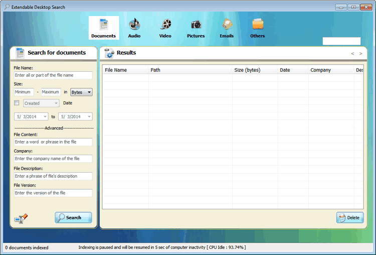
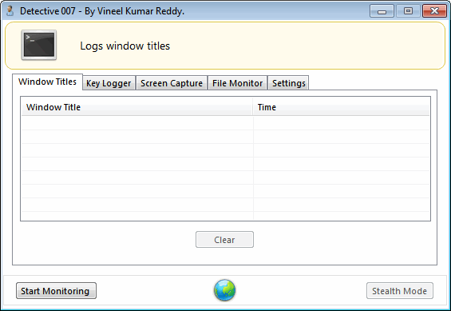

---
title: "Projects"
tags: ['projects']
---

## 🕹️ Chip8 Emulator

**Chip8 Emulator** is a CHIP-8 emulator written in Java that interprets and
executes programs designed for the CHIP-8 virtual machine, a simple interpreted
programming language from the 1970s originally used on early microcomputers. The
emulator implements the core components of the CHIP-8 architecture including a
CPU for instruction execution, 4KB of memory, a 64x32 pixel monochrome display,
and a 16-key hexadecimal keyboard, allowing users to run classic CHIP-8 games
and programs such as Pong, Tetris, Space Invaders, and Breakout. Built using
Maven as a build system, the project includes over 20 ROM files for various
games and utilities, providing a complete implementation of the CHIP-8
specification that serves as both an educational tool for understanding emulator
development and a functional interpreter for running vintage CHIP-8 software.

🔗 [https://github.com/vineelkovvuri/Projects/tree/master/Chip8Emulator](https://github.com/vineelkovvuri/Projects/tree/master/Chip8Emulator)

---

## 🔍 Extendable Desktop Search

**Extendable Desktop Search** is a Windows desktop search application built in
C# that indexes and searches various types of files on a local system using the
Lucene.Net search engine. The project features an extensible plugin architecture
with specialized parsers for different file formats including documents (DOC,
PDF), multimedia files (audio, video, images), archives, HTML, text files, and
executables, enabling efficient content extraction and indexing. It provides a
categorized GUI interface with separate user controls for searching through
different file types (All Files, Documents, Audio, Video, Pictures, Email), and
includes core modules for file system crawling, real-time file system
monitoring, indexing, and query execution, making it a comprehensive local
search solution similar to Windows Search or Google Desktop.

🔗 [https://github.com/vineelkovvuri/Projects/tree/master/ExtendableDesktopSearch](https://github.com/vineelkovvuri/Projects/tree/master/ExtendableDesktopSearch)

---

## 🕵️ Detective-007

**Detective-007** is a Windows Forms stealth monitoring application written in
C# that functions as a keylogger and system surveillance tool. The application
captures keyboard input through low-level hooks, monitors active window titles
to track which applications users are accessing, and takes periodic screenshots
at configurable intervals (default 60 seconds). It also watches for USB drive
insertions using FileSystemWatcher to monitor all logical drives on the system.
The application can run hidden from the user, automatically starts with Windows
through registry modifications, and is password-protected to prevent
unauthorized access. All captured data including keystrokes, window activity,
and screenshots are logged for later review through a dedicated interface that
allows viewing of pictures and recorded activity.

🔗 [https://github.com/vineelkovvuri/Projects/tree/master/Detective-007](https://github.com/vineelkovvuri/Projects/tree/master/Detective-007)

---

## 🧩 PeLib

**PeLib** is a C++ library for parsing and analyzing Windows Portable Executable
(PE) file format, which is used for executables, DLLs, and other binary files on
Windows systems. The library provides structured access to the various
components of PE files including the DOS header, COFF header, optional header,
section tables, import/export tables, and data directories, with functionality
to read PE files, convert between relative virtual addresses (RVA) and file
addresses (FA), and dump PE file information for inspection and analysis
purposes.

🔗 [https://github.com/vineelkovvuri/Projects/tree/master/PeLib](https://github.com/vineelkovvuri/Projects/tree/master/PeLib)
